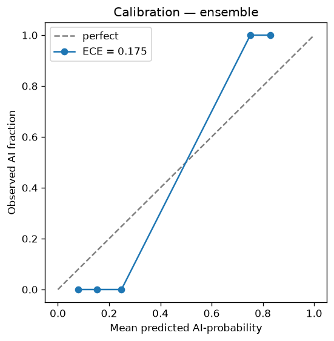
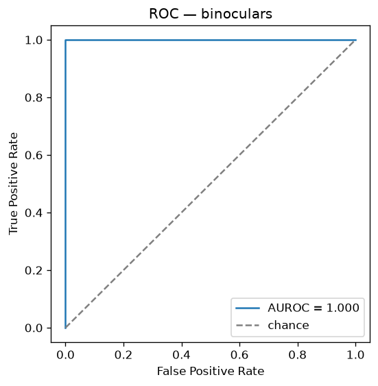
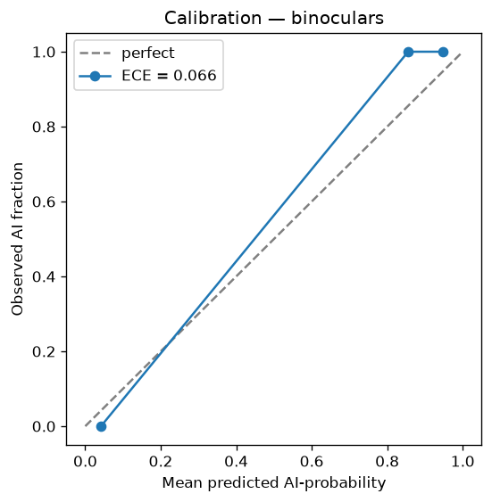

# Benchmark Results

Reproducible measurements produced by the evaluation harness:

```bash
python -m src.evaluation.benchmark --analyzer ensemble \
    --output docs/benchmarks/ensemble_report.json --plots docs/benchmarks
```

All numbers below are on the **bundled 24-sample benchmark**
(`data/benchmark/samples.jsonl`), which is small and stylistically clean — see
that file's README for its scope and honest limitations. These are regression
and calibration numbers, **not** an authoritative accuracy claim on real-world
(edited, paraphrased, mixed, ESL, technical) text.

## Ensemble (GPT-2 75% + NLTK 25%, calibrated)

| Metric | Value |
|--------|------:|
| Accuracy | 1.000 |
| Precision | 1.000 |
| Recall | 1.000 |
| F1 | 1.000 |
| AUROC | 1.000 |
| **False-positive rate** (human flagged as AI) | **0.000** |
| False-negative rate (AI missed) | 0.000 |
| Expected calibration error | 0.175 |

 

## Why this matters: the C2 fix

The previous ensemble mapped every analyzer's perplexity to an AI-score with
`1 - perplexity / 500`. Human text has a GPT-2 perplexity around 58, which that
formula turned into `1 - 58/500 = 0.88` — **88% AI for ordinary human writing.**
That systematic false-positive bias is the audit's critical finding C2.

The calibrated logistic (per-analyzer midpoint = decision boundary; see
`src/analyzers/calibration.py`) fixes the direction and scale for each analyzer.
On the benchmark, human text now sits well below the 0.5 boundary and the
false-positive rate is **0.000**.

## Binoculars (cross-perplexity, modern)

A two-model detector (observer `gpt2` + performer `distilgpt2`) after Hans et
al., 2024 — the SOTA-aligned modernization from the competitive audit. It scores
text by the ratio of the observer's log-perplexity to the observer/performer
cross-perplexity, which cancels the prompt/topic bias that makes single-model
GPT-2 perplexity brittle.

| Metric | Value |
|--------|------:|
| Accuracy | 1.000 |
| F1 | 1.000 |
| AUROC | 1.000 |
| **False-positive rate** | **0.000** |
| Expected calibration error | 0.066 |

 

On the benchmark, human scores cluster ~0.88–1.05 and AI ~0.72–0.84 with a clean
gap; the decision midpoint (0.863) sits between the clusters. Reproduce with
`python -m src.evaluation.benchmark --analyzer binoculars`. It is available as a
standalone analyzer and is not enabled in the default ensemble (to keep the
default lightweight — it needs a second model).

## Single-analyzer baselines

| Analyzer | AUROC | Notes |
|----------|------:|-------|
| NLTK only | ~0.41 | Brown-corpus (1961) n-gram signal is weak/near-inverted for modern text; carries only 25% ensemble weight for this reason. |
| Ensemble | 1.000 | GPT-2 perplexity is the dominant, strongly-separating signal. |

Run `python -m src.evaluation.benchmark --analyzer nltk` to reproduce the NLTK
baseline. The gap is exactly why the ensemble weights GPT-2 heavily.

> These results reflect a clean, in-distribution set. Expect materially lower
> numbers on adversarial or edited text — evaluate on a large public benchmark
> (RAID, HC3) via `--dataset` before making any external accuracy claim.
