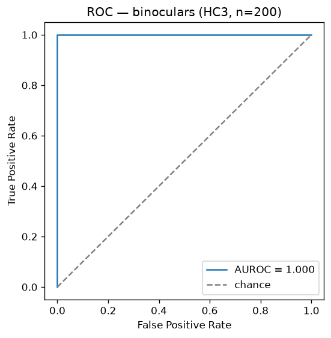
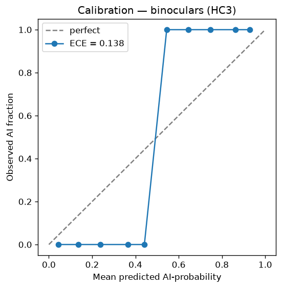

# Benchmark Results

Two corpora are used, and **they are not equally trustworthy**:

| Corpus | Size | What it is | Use it for |
|--------|-----:|------------|------------|
| **HC3** (`data/external/`) | 200 | Real human answers (Reddit/finance/medicine/open-QA) vs **real ChatGPT output** | **Accuracy. This is the number that counts.** |
| Bundled (`data/benchmark/`) | 24 | Hand-written human prose vs **hand-written imitations of LLM style** | Pipeline regression only — see the warning below |

Reproduce everything:

```bash
python scripts/prepare_hc3.py                    # downloads + samples HC3 (not committed)
python -m src.evaluation.benchmark --analyzer ensemble \
    --dataset data/external/hc3_sample.jsonl
```

---

## HC3 — real human text vs real ChatGPT output (n=200, balanced)

| Analyzer | Accuracy | AUROC | **FPR** (human flagged AI) | FNR (AI missed) | ECE |
|----------|---------:|------:|---------------------------:|----------------:|----:|
| **Binoculars** | **1.000** | **1.000** | **0.000** | 0.000 | 0.138 |
| Ensemble (GPT-2 + NLTK) | 0.950 | 0.998 | 0.100 | 0.000 | 0.201 |
| GPT-2 alone | 0.750 | 0.756 | **0.500** | 0.000 | 0.170 |
| NLTK alone | 0.500 | 0.420 | 0.000 | 1.000 | 0.472 |

 

**Read this table carefully:**

- **Binoculars is the detector to use.** Its cross-perplexity ratio separates real
  human text from real ChatGPT output perfectly on this corpus.
- **GPT-2 alone flags half of real human text as AI** (FPR 0.500). Do not use the
  GPT-2-only app to make decisions about people. Single-model perplexity is
  exactly as brittle as the literature says.
- **NLTK alone is below chance** (AUROC 0.420). It never flags AI. Its value is
  as a *human-side prior* inside the ensemble, where it corrects GPT-2's
  over-flagging — which is why the ensemble (0.950) beats GPT-2 alone (0.750).
- **AUROC ≫ accuracy means the threshold, not the signal, is wrong.** Before
  recalibration, Binoculars scored AUROC 1.000 with FPR 0.460: perfect ranking,
  useless boundary.

### How the Binoculars boundary was fitted

`BinocularsConfig.score_midpoint` is fitted on HC3 with a proper held-out split
(`scripts/calibrate_binoculars.py`): the corpus is split 50/50 stratified, the
midpoint is swept on the calibration half, and reported on the **held-out half**.

```
ratio  human: min=0.7668 med=0.8840 max=1.0975
ratio  ai   : min=0.5953 med=0.6633 max=0.7624
fitted midpoint = 0.7625
HELD-OUT half (n=100): accuracy 1.000, FPR 0.000, FNR 0.000
```

The previous value (0.863) was fitted on the bundled set and **sat inside the
real human cluster**, flagging 46% of real human text as AI.

---

## ⚠️ The bundled 24-sample set is NOT an accuracy benchmark

Its "AI" samples are **hand-written imitations of LLM style, not real model
output**. Real ChatGPT text has Binoculars ratios of 0.60–0.76; the imitations
score 0.72–0.84 — overlapping the *human* range of real data.

Consequence: with the correctly-fitted boundary, Binoculars classifies 11 of the
12 bundled "AI" samples as human-written (FNR 0.917) — **and it is right to do
so**, because a human wrote them. AUROC stays 1.000 (the ranking is fine); only
the labels are wrong about what they represent.

Keep this set for what it is: a fast, deterministic fixture that exercises the
pipeline end-to-end. Never cite its numbers as accuracy.

---

## Honest limitations

- HC3 is ChatGPT-era output. Newer models, **edited** or **paraphrased** AI text,
  and human/AI **mixed** documents are all harder and are not measured here.
- 200 samples gives wide confidence intervals. Scale up with
  `--per-class` before making strong claims.
- No evaluation on adversarial ("humanizer") attacks, non-English text, or human
  sub-populations (ESL writers, students) where false positives cause real harm.
  **Publishing per-population FPR is the responsible next step.**
- Ensemble ECE 0.201 means its *probabilities* are poorly calibrated even though
  its *ranking* is strong (AUROC 0.998). Treat the confidence number with
  suspicion; trust the ordering.
